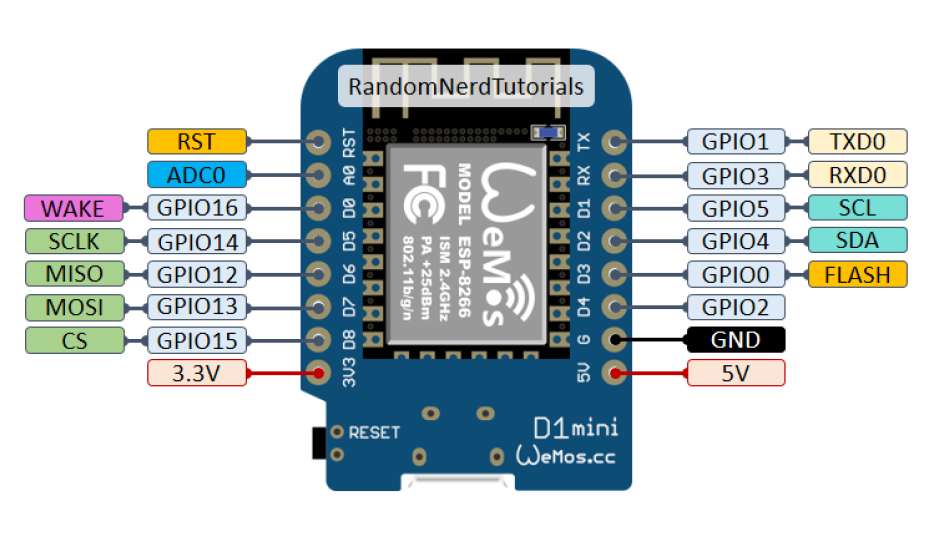
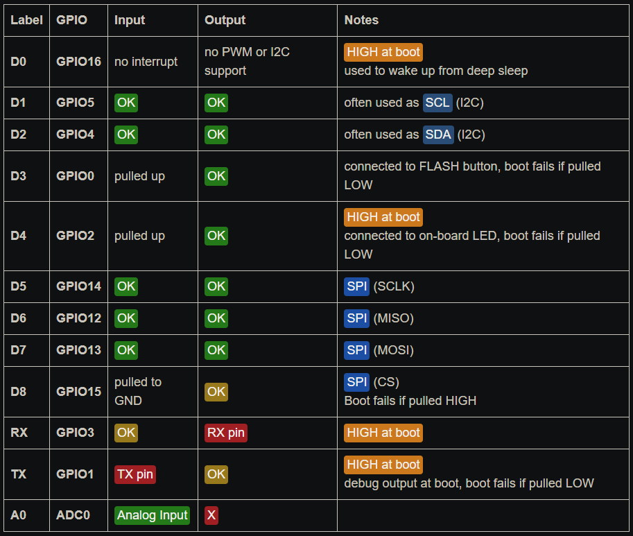

# This repo contains Wifi pc power controller

### Use arduino ide to compile the code.

### Enable the ESP8266 board by add additional boards manager.

```bash
https://arduino.esp8266.com/stable/package_esp8266com_index.json
```

## Circuit Schematic


## Wemos D1 mini board pins:



## Pin details:


